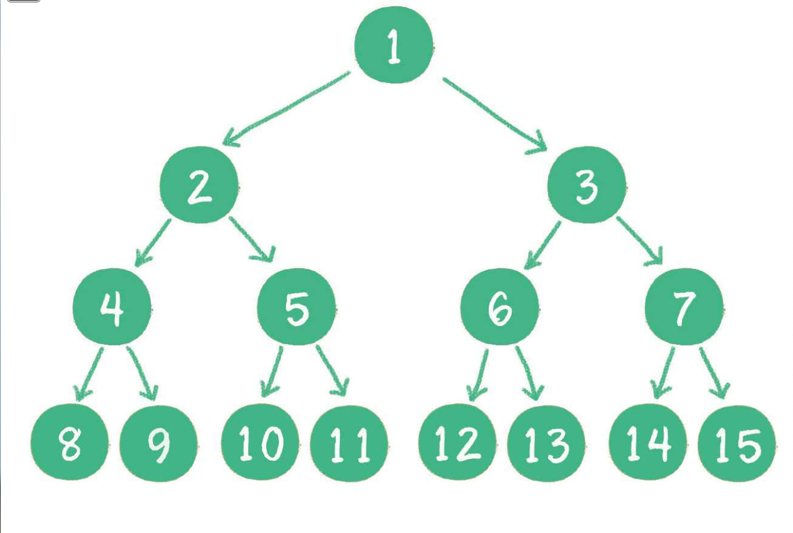
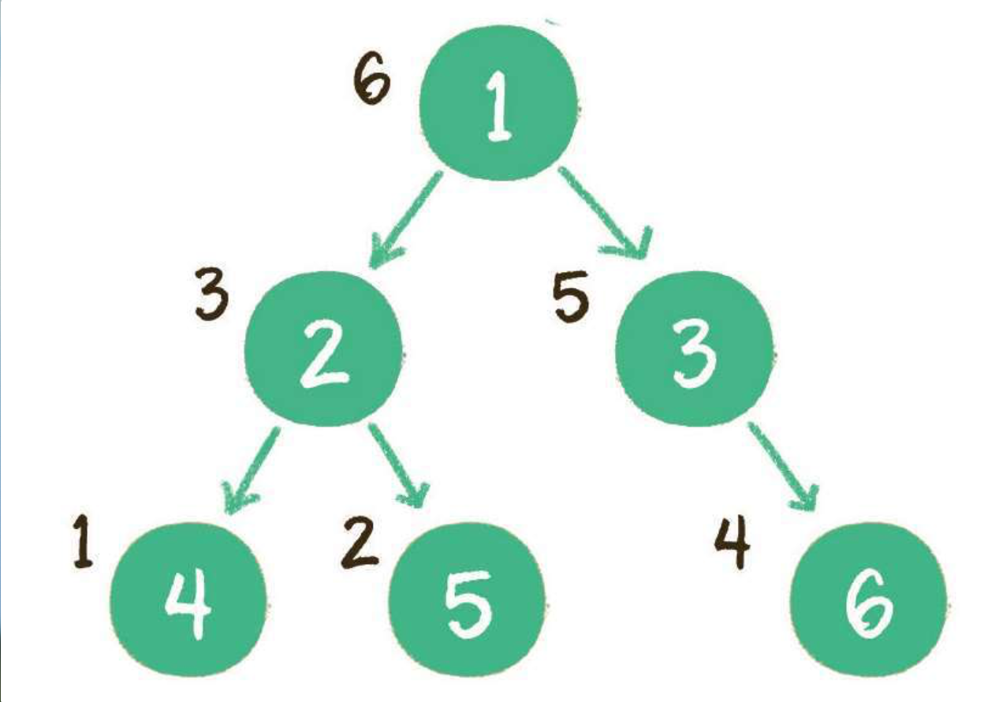

## 树

### 基本概念

* 根节点
* 子树
* 叶子节点
* 父节点
* 孩子节点
* 兄弟节点
* 树高度

### 二叉树

特殊的树，最多只能有两个孩子节点，也可以没有.

#####  满二叉树

    所有非叶子结点都存在左右孩子，并且所有叶子结点都在同一层级。
    

##### 完全二叉树
    所有叶子结点的编号和满二叉树的编号一致，就是完全二叉树
    

    

##### 二叉查找树

* 如果左子树不为空，则左子树上所有节点的值均小于根节点的值
* 如果右子树不为空，则右子树上所有节点的值均大于根节点的值
* 左、右子树也都是二叉查找树 

##### 二叉排序树

二叉查找树的别名，按照二叉查找树的规则进行插入

### 遍历

#### 深度优先
 * 前序遍历
 * 中序遍历
 * 后序遍历

#### 广度优先

 * 层序遍历s
 
 
##### 前序遍历
 
 输出顺序：根节点 -> 左子树 -> 右子树
 
 

##### 中序遍历
 
 输出顺序：左子树 -> 根节点 -> 右子树
 
 

##### 后序遍历
 
 输出顺序：左子树 -> 右子树 -> 根节点
 
 