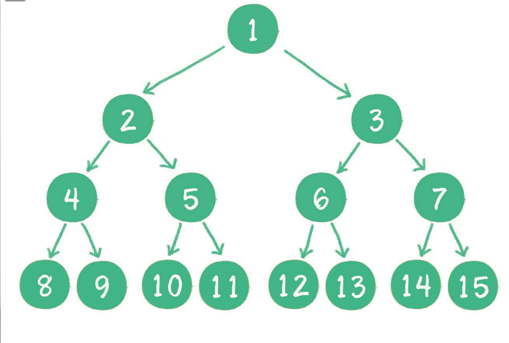
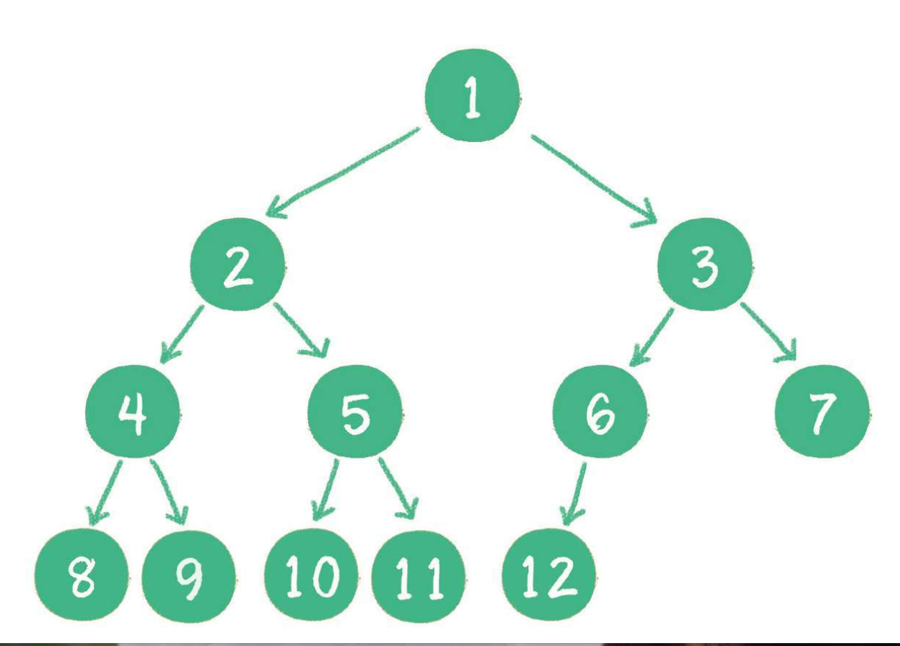
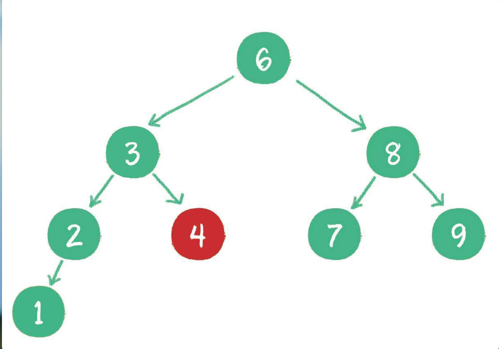
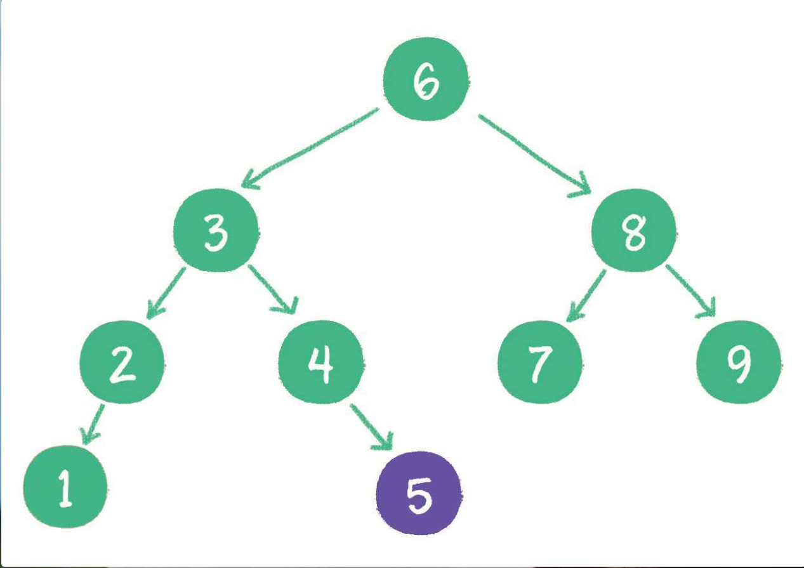
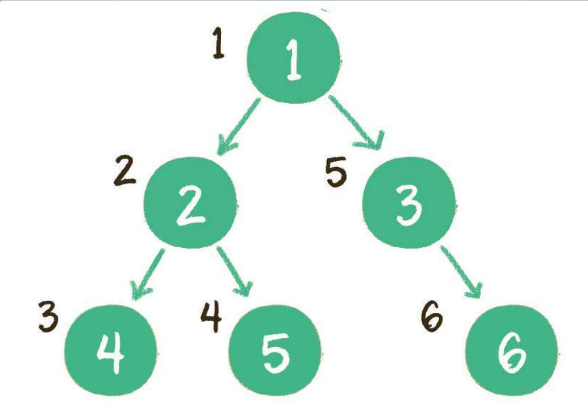
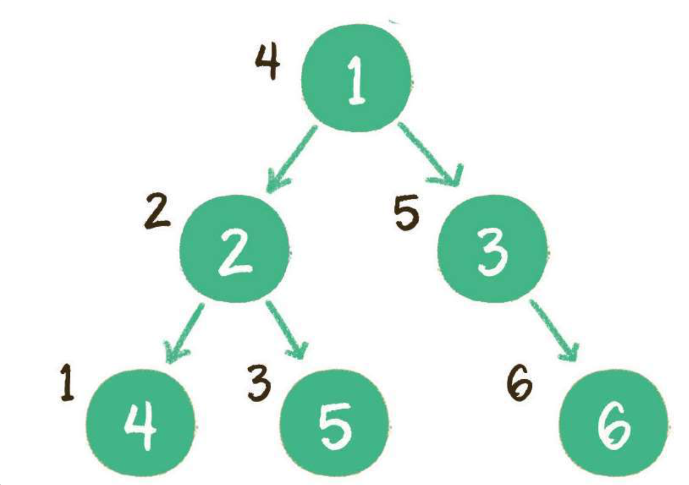
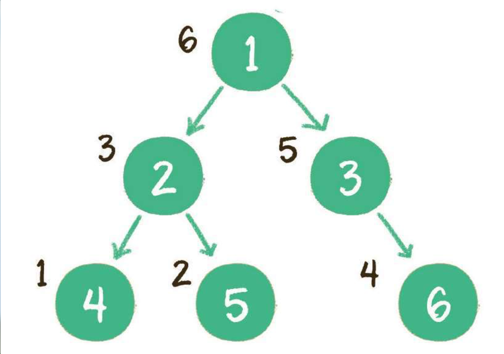
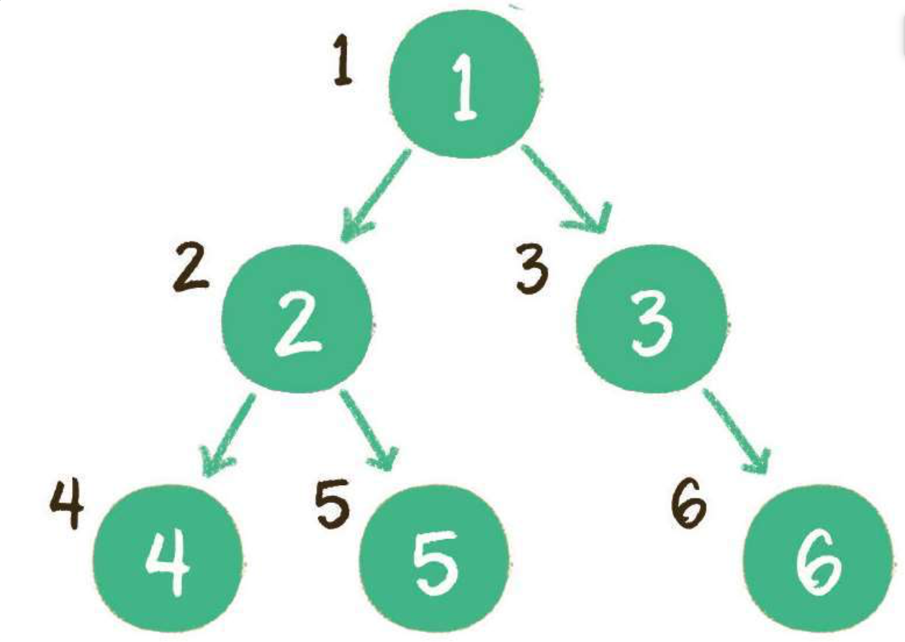

​              

## 树

### 基本概念

* 根节点
* 子树
* 叶子节点(没有子节点，度为0)
* 父节点
* 孩子节点
* 兄弟节点
* 树高度
* 结点的度（结点拥有的子树数）

### 二叉树

特殊的树，最多只能有两个孩子节点，也可以没有.

#### 满二叉树

    所有非叶子结点都存在左右孩子，并且所有叶子结点都在同一层级。

#### 完全二叉树

    将树按照层级顺序编号，所有叶子结点的编号和满二叉树的编号一致，就是完全二叉树。

* 叶子结点只能在最下两层
* 最下层叶子一定在左边连续位置
* 倒数第二层，如果有叶子一定在右边

   

#### 二叉查找树

* 如果左子树不为空，则左子树上所有节点的值均小于根节点的值
* 如果右子树不为空，则右子树上所有节点的值均大于根节点的值
* 左、右子树也都是二叉查找树 

#### 二叉排序树

二叉查找树的别名，按照二叉查找树的规则进行插入

### 遍历

#### 深度优先
 * 前序遍历
 * 中序遍历
 * 后序遍历

#### 广度优先

 * 层序遍历

##### 1.前序遍历

 输出顺序：根节点 -> 左子树 -> 右子树

 

##### 2.中序遍历

 输出顺序：左子树 -> 根节点 -> 右子树

 

##### 3.后序遍历

 输出顺序：左子树 -> 右子树 -> 根节点

 

##### 4.层序遍历

 按照二叉树的层级关系，逐层遍历每个节点

 

### 堆

​	特殊的完全二叉树，分为最大堆和最小堆。

* 最大堆，任何一个父节点的值，都大于等于孩子的值
* 最小堆，任何一个父节点的值，都小于等于孩子的值。

### 优先队列

​	利用二叉堆实现的优先队列时间复杂度O(logn)

​	队列本是先进先出（FIFO），优先队列的原则是：

* 最大优先队列，无论入队顺序如何，都是当前队列中最大元素出队

* 最小优先队列，无论入队顺序如何，都是当前队列中最小元素出队

  要实现优先队列，就利用二叉堆的特性。

新插入结点在末端，让结点上浮到合适位置，让原来堆顶点元素出队，把最后一个元素替换到堆顶，让新的堆顶元素下沉到合适位置。

​	