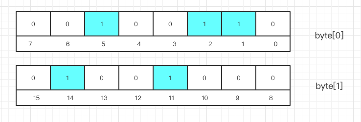
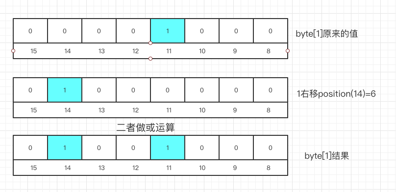
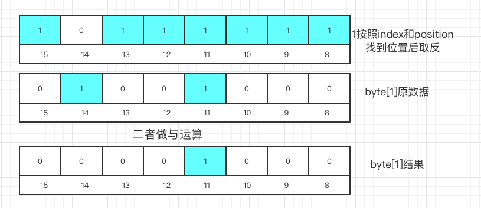
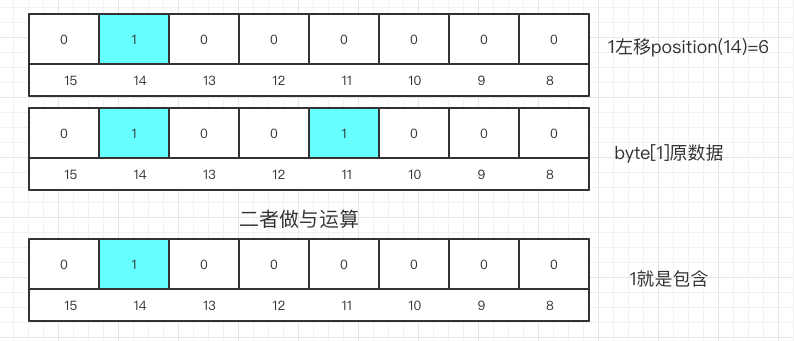

## BitMap 算法

位图？以位为图，也就是基于位的索引进行操作。

#### 1、问题

10亿个整数进行查找排序？一个int占据4个字节，一个字节8bit，一次性加载这10亿个数字则需要：10亿*4个bit,换算下约等于10亿*4/(1024*1024*1024)≈3.72G，估计内存会挂掉。

#### 2、BitMap分析

一个字节byte占据8个bit，如果把每个bit的值0或者1用来表示某个数字有或者没有出现过，也能描述问题。

比如一个数组：int [] arr = {1,2,5,11,14};只用两个字节即可表示。



那么10个亿的数据就能用3.72G/32=119M即可

#### 3、图表示

首先搞清楚的一个问题是：一个数字(num)如何定位到它的索引Index，也就是说它应该出现在哪个字节的第几位(position)?

```java
Index = num / 8 = num >> 3
position = num % 8 = num & 0x07    //被模数是2的n次方的时候可以用与运算
```

举例：求14的索引及位置，Index = 14/8  = 1, position= 14%8 = 6.

##### ***添加数据***（add）

add的操作就是将对应位置的0变为1。具体操作过程就是将1左移position位，然后找和对应索引的原值，做或运算。

add(N) = index(N) |= 1<< position(N)



##### ***清除数据***（clear）

clear的操作，对1进行左移，然后取反，最后和原数字进行与运算。



##### ***包含检测***(contain)

1左移合适位置后直接和原数据做与运算




#### 4、代码

```java
public class BitMap {
    //保存数据的
    private byte[] bits;
    //能够存储多少数据
    private int capacity;

    public BitMap(int capacity) {
        this.capacity = capacity;
        //1byte能存储8个数据，那么capacity数据需要多少个byte呢，capacity/8+1,右移3位相当于除以8
        bits = new byte[(this.capacity >> 3) + 1];
    }

    private void add(int element) {
        //找到数据存放的位置
        int index = element / 8;
        int position = element % 8;
        bits[index] |= 1 << position;
    }

    private void clear(int element) {
        int index = element / 8;
        int position = element % 8;
        bits[index] &= ~(1 << position);
    }

    private boolean contain(int element) {
        int index = element / 8;
        int position = element % 8;
        return (bits[index] & (1 << position)) != 0;
    }

    public static void main(String[] args) {
        BitMap bitmap = new BitMap(100);
        bitmap.add(7);
        System.out.println("插入7成功");

        boolean isexsit = bitmap.contain(7);
        System.out.println("7是否存在:" + isexsit);

        bitmap.clear(7);
        isexsit = bitmap.contain(7);
        System.out.println("7是否存在:" + isexsit);
    }
}
```

参考

[Java源码BitSet.java]