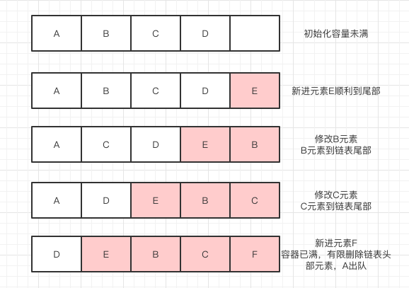

## LRU 算法


LRU算法（Least Recently Used），最近最少使用原则，对数据进行管理。

### 哈希链表

哈希表是KEY_VALUE结构的容器，在此结构上这些键值对是没有排列顺序的，无所谓先后。

在哈希链表中，这些键值对不再是彼此无关系的存在，而是被串起来的。每一个键值对都有它的前驱后继KEY-VALUE，就像双向链表中的结点一样。这样无序的哈希表就有了固定的排列顺序。

### 基本思路

以一张图演示一下LRU算法的基本思路。

a.初始化存储容器，可以接收5个元素，并存入4个元素。

b.在容器未满的情况下，要存储元素E，可以直接加入到容器中。

c.元素B的值有更新之后，将元素B移动到链表末端，C代替B原来的位置。

d.元素C的值更新之后，重复上一步的步骤，移动到链表尾部。此时链表结构就是[A-D-E-B-C]

e.再有新元素F想进入，则将链表中头部元素移除，把A删除，D称为链表头。




### 代码

```java
public class LruAlgo {
    public static void main(String [] args){
        LruAlgo lruCache = new LruAlgo(5);
        lruCache.put("001","用户1");
        lruCache.put("002","用户2");
        lruCache.put("003","用户3");
        lruCache.put("004","用户4");
        lruCache.put("005","用户5");
        String msg002 = lruCache.get("002");
        System.out.println(msg002);
        lruCache.put("004","用户4信息更新");
        lruCache.put("006","用户6信息更新");
        System.out.println(lruCache.get("001"));
        System.out.println(lruCache.get("006"));
        System.out.println(lruCache.get("002"));
        System.out.println(lruCache.get("004"));
    }

    private Node head;//链表头部元素
    private Node end;//链表尾部元素

    private int limit;//容器限制

    private HashMap<String, Node> hashMap;

    public LruAlgo(int limit) {
        this.limit = limit;
        hashMap = new HashMap<>();
    }

    public String get(String key) {
        Node node = hashMap.get(key);
        if (node == null) return null;
        refreshNode(node);
        return node.value;
    }

    public void put(String key, String value) {
        Node node = hashMap.get(key);
        if (node == null) {
            //找不到就插入
            if (hashMap.size() >= limit) {
                String oldKey = removeNode(head);
                hashMap.remove(oldKey);
            }
            node = new Node(key, value);
            addNode(node);
            hashMap.put(key, node);
        } else {
            node.value = value;
            refreshNode(node);
        }
    }

    private void addNode(Node node) {
        if (end != null){
            end.next = node;
            node.pre = end;
            node.next = null;
        }
        end = node;
        if (head == null){
            head = node;
        }
    }

    private void remove(String key) {
        Node node = hashMap.get(key);
        refreshNode(node);
        hashMap.remove(key);
    }

    private String removeNode(Node node) {
        if (node == head && node == end) {
            //remove the last node
            head = null;
            end = null;
        } else if (node == end) {
            end = end.pre;
            end.next = null;
        } else if (node == head) {
            head = head.next;
            head.pre = null;
        } else {
            node.pre.next = node.next;
            node.next.pre = node.pre;
        }
        return node.key;
    }

    private void refreshNode(Node node) {
        if (node == end) {
            return;
        }
        removeNode(node);
        addNode(node);
    }

    static class Node {
        public Node(String key, String value) {
            this.key = key;
            this.value = value;
        }
        Node pre;
        Node next;
        String key;
        String value;
    }
}
```