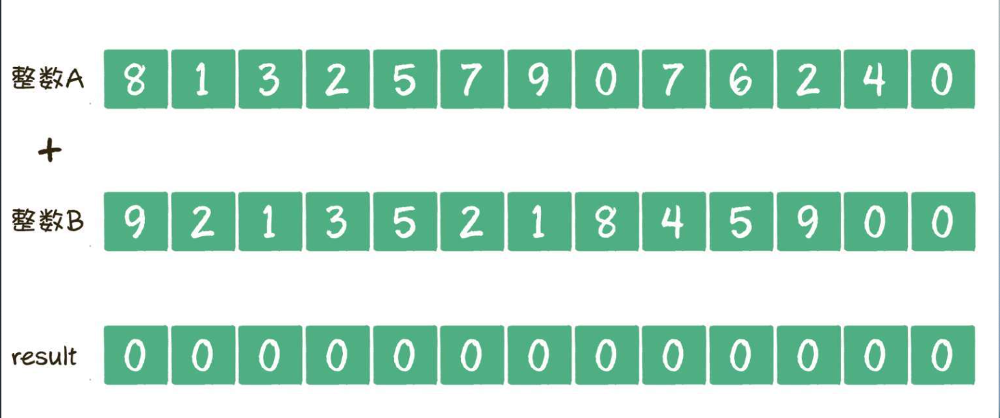
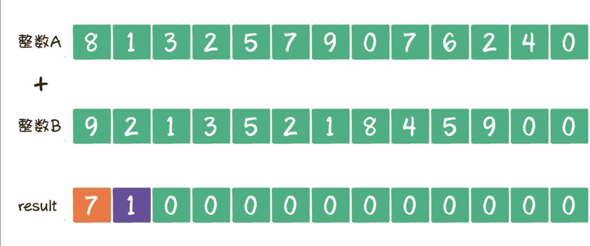

## 两个大数相加

两个比较大的数字，426709752318和95481253129相加，得出结果？


### 思路

分别为每个数字建立一个数组，数组长度比较大数字的长度多一位，然后将数字逆序添加到数组中。



遍历两个数组，从左往右按位相加，相加结果大于10的就进位1，



如此循环到数组结束，最后将数组全部元素逆序，去掉首位的0，就是最终结果。


### 代码

```java
private static String bigNumSum(String bigNumA,String bigNumB){
    //1.把两个大整数用数组逆序存储，数组长度等于较大整数位数+1
    int maxLength = bigNumA.length() > bigNumB.length() ?bigNumA.length():bigNumB.length();
    int[] arrayA = new int[maxLength + 1];
    for (int i = 0; i < bigNumA.length(); i++) {
        //逆序存储
        arrayA[i] = bigNumA.charAt(bigNumA.length() -1 - i) - '0';
    }
    int[] arrayB = new int[maxLength + 1];
    for (int i = 0; i < bigNumB.length(); i++) {
        arrayB[i] = bigNumB.charAt(bigNumB.length() -1 - i) - '0';
    }
    //2.构建result数组，长度也是一样的
    int [] result = new int[maxLength+1];
    //3.遍历数组，按位相加
    for (int i = 0; i < result.length; i++) {
        int temp = result[i];
        temp += arrayA[i];
        temp += arrayB[i];
        if (temp > 10){
            temp = temp -10;
            result[i+1] = 1;
        }
        result[i] = temp;
    }
    //4.把result数组再次逆序并转成String
    StringBuilder sb = new StringBuilder();
    boolean findFirst = false;
    for (int i = result.length - 1; i >= 0 ; i--) {
        if (!findFirst){
            if (result[i] == 0){
                continue;
            }
            findFirst = true;
        }
        sb.append(result[i]);
    }
    return sb.toString();
}
```


### 优化

如果相加的数字是50位呢？创建一个51位的数组吗？

没必要拆分如此细致，只要拆分到可以直接计算就可以了，int可以接收的最大数字（-2147483648~2147483647）位数是10位，为了防止溢出，可以把每9位作为数组的一个元素，进行运算。建立一个长度为6的数组，每个元素存储9位数字，参考BigInteger。