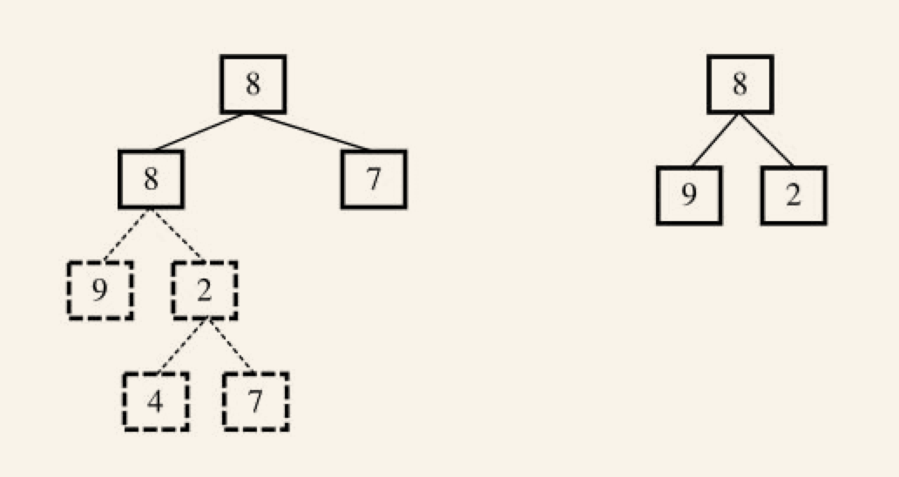

### 判断二叉树的子树结构


#### 思路

第一步在树A中找到和B的根结点的值一样的结点R，第二步再判断树A中以R为根结点的子树是不是包含和树B一样的结构。


首先试着在树A中找到树B的根结点的值的结点。从树A的根结点开始遍历，接着就去判断树A的根结点下面的子树是不是含有和树B一样的结构。在树A中，根结点的左子结点的值是8，而树B的根结点的左子结点是9，对应的两个结点不同。



因此我们仍然需要遍历树A，接着查找值为8的结点。我们在树的第二层中找到了一个值为8的结点，然后进行第二步判断，即判断这个结点下面的子树是否含有和树B一样结构的子树。于是我们遍历这个结点下面的子树，先后得到两个子结点9和2，这和树B的结构完全相同。此时我们在树A中找到了一个和树B的结构一样的子树，因此树B是树A的子结构。


#### 代码


```java
public class IsSubTree {

    public static void main(String[] args) {
        BinaryTreeNode rootA = new BinaryTreeNode(8);
        rootA.left = new BinaryTreeNode(8);
        rootA.right = new BinaryTreeNode(7);

        rootA.left.left = new BinaryTreeNode(9);
        rootA.left.right = new BinaryTreeNode(2);

        rootA.left.right.left = new BinaryTreeNode(4);
        rootA.left.right.right = new BinaryTreeNode(7);

        BinaryTreeNode rootB = new BinaryTreeNode(8);
        rootB.left = new BinaryTreeNode(9);
        rootB.right = new BinaryTreeNode(2);
        System.out.println(isSubtree(rootA, rootB));
    }

    private static boolean isSubtree(BinaryTreeNode rootA, BinaryTreeNode rootB) {

        boolean result = false;
        if (rootA != null && rootB != null) {
            if (rootA.value == rootB.value) {
                result = containsTree(rootA, rootB);
            }
            if (!result) {
                result = isSubtree(rootA.left, rootB);
            }
            if (!result) {
                result = isSubtree(rootA.right, rootB);
            }
        }
        return result;
    }

    private static boolean containsTree(BinaryTreeNode rootA, BinaryTreeNode rootB) {
        boolean result;
        if (rootB == null) return true;
        if (rootA == null) return false;
        if (rootA.value != rootB.value) {
            return false;
        }
        return containsTree(rootA.left, rootB.left) & containsTree(rootA.right, rootB.right);
    }

    static class BinaryTreeNode {
        int value;
        public BinaryTreeNode(int value) {
            this.value = value;
        }
        BinaryTreeNode left;
        BinaryTreeNode right;
    }
}
```