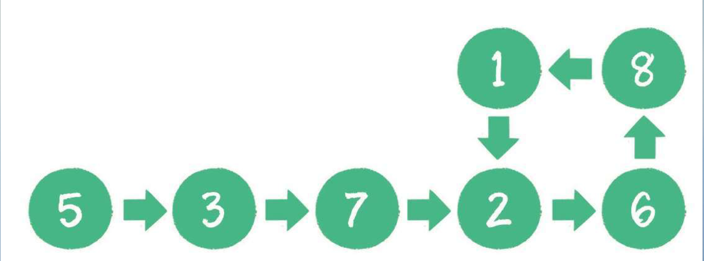
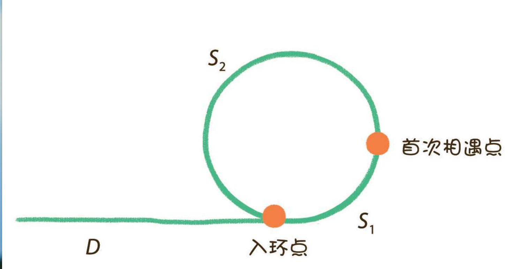

如下图，如何判断链表有环？



### 1.遍历

​	从头部结点开始遍历，每遍历到新的结点，就和此节点之前的每个结点做比较，如果相等，就证明有环。

​	时间复杂度为O(n²)，空间复杂度为O()1

### 2.哈希字典

​	简历以结点ID为KEY的哈希表，从头开始遍历，并存入表中，如果存入的时候发现表中已经存在了元素，

证明有环。
    时间复杂度 O(n),空间复杂度O()n

### 3.解题思路

​	创建两个指针（P1和P2），指向第一个结点，让P1每次向后移动一个结点，P2每次向后移动两个结点，比较两个结点的值，如果相同，证明有环，如果不同，继续下次循环。
​	数学上的追及问题，在环形跑道上，跑得快的人一定能追上并超过速度慢的人，
​	时间复杂度O(n),空间复杂度O（1）

### 4.代码实现

```java
public class LinkedCycle {
    public static void main(String [] args){
         Node node1 = new Node(5);
         Node node2 = new Node(3);
         Node node3 = new Node(7);
         Node node4 = new Node(2);
         Node node5 = new Node(6);
         node1.next = node2;
         node2.next = node3;
         node3.next = node4;
         node4.next = node5;
         node5.next = node2;
        System.out.println(isCycle(node1));
    }

    private static boolean isCycle(Node head){
        Node p1 = head,p2 = head;

        while (p2 != null && p2.next != null){
            p1 = p1.next;
            p2 = p2.next.next;
            if (p1 == p2){
                return true;
            }
        }
        return false;
    }
}

class Node{
    int data;
    Node next;
    public Node(int data) {
        this.data = data;
    }
}
```


### 5.环的长度

​	既然有环，让两个指针从相遇点继续前进，再次相遇的时候就是环的长度，快的指针比慢的指针多走了一圈。

​	环的长度= 速度差 * 前进次数


### 6.入环点



假设从链表头节点到入环点的距离是D，从入环点到两个指针首次相遇点的距离是S1，从首次相遇点回到入环点的距离是S2。

那么，当两个指针首次相遇时，各自所走的距离是多少呢？

指针p1一次只走1步，所走的距离是D+S1。

指针p2一次走2步，多走了n(n>=1)整圈，所走的距离是`D+S1+n(S1+S2)`

由于p2的速度是p1的2倍，所以所走距离也是p1的2倍，因此：`2(D+S1) = D+S1+n(S1+S2)`

等式经过整理得出：`D = (n-1)(S1+S2)+S2`

也就是说，从链表头结点到入环点的距离，等于从首次相遇点绕环n-1圈再回到入环点的距离。

这样一来，只要把其中一个指针放回到头节点位置，另一个指针保持在首次相遇点，两个指针都是每次向前走1步。那么，它们最终相遇的节点，就是入环节点。
