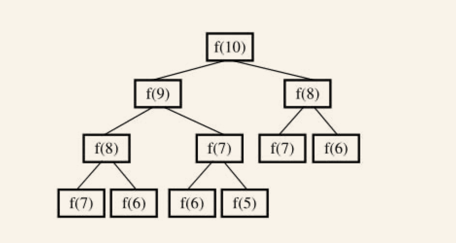

### 斐波那契数列


#### 实现

```java
private static int fibonacci1(int num) {
    if (num <= 0) return 0;
    if (num == 1) return 1;
    return fibonacci1(num - 1) + fibonacci1(num - 2);
}
```

很快就实现了

但是,存在很严重的效率问题，求f(10)需要先求出f(9)和f(8)的结果，求f(9)又要求出f(8)和f(7)的结构，将这一过程构造为一棵树查看：




树中有很多结点是重复的，而且重复的结点数会随着n的增大而急剧增加，这意味计算量会随着n的增大而急剧增大。事实上，用递归方法计算的时间复杂度是以n的指数的方式递增的。

#### 优化

```java
/**
 * 优化一下实现，将每次计算过的结果进行保存，不需要每次都进行计算
 */
private static int fibonacci2(int num) {
    int [] result = {0,1};
    if (num <=1){
        return result[num];
    }
    int indexOne = 0;
    int indexTwo = 1;
    int N = 0;
    for (int i = 2; i <= num; i++) {
        N = indexOne + indexTwo;
        indexOne = indexTwo;
        indexTwo = N;
    }
    return N;
}
```

#### 变形

* 一只青蛙一次可以跳上1级台阶，也可以跳上2级。求该青蛙跳上一个n级的台阶总共有多少种跳法。

如果只有1级台阶，那显然只有一种跳法。如果有2级台阶，那就有两种跳的方法了：一种是分两次跳，每次跳1级；另外一种就是一次跳2级。

接着再来讨论一般情况。把n级台阶时的跳法看成是n的函数，记为f（n）。当n>2时，第一次跳的时候就有两种不同的选择：一是第一次只跳1级，此时跳法数目等于后面剩下的n－1级台阶的跳法数目，即为f（n－1）；另外一种选择是第一次跳2级，此时跳法数目等于后面剩下的n－2级台阶的跳法数目，即为f（n－2）。n级台阶的不同跳法的总数f（n）=f（n－1）＋f（n－2）。


* 在青蛙跳台阶的问题中，如果把条件改成：一只青蛙一次可以跳上1级台阶，也可以跳上2级……它也可以跳上n级，此时该青蛙跳上一个n级的台阶总共有多少种跳法？我们用数学归纳法可以证明f（n）=2n－1。

* 我们可以用2×1的小矩形横着或者竖着去覆盖更大的矩形。请问用8个2×1的小矩形无重叠地覆盖一个2×8的大矩形，总共有多少种方法？

  我们先把2×8的覆盖方法记为f（8）。用第一个1×2小矩形去覆盖大矩形的最左边时有两个选择，竖着放或者横着放。当竖着放的时候，右边还剩下2×7的区域，这种情形下的覆盖方法记为f（7）。接下来考虑横着放的情况。当1×2的小矩形横着放在左上角的时候，左下角必须和横着放一个1×2的小矩形，而在右边还还剩下2×6的区域，这种情形下的覆盖方法记为f（6），因此f（8）=f（7）＋f（6）。此时我们可以看出，这仍然是斐波那契数列。

  

  