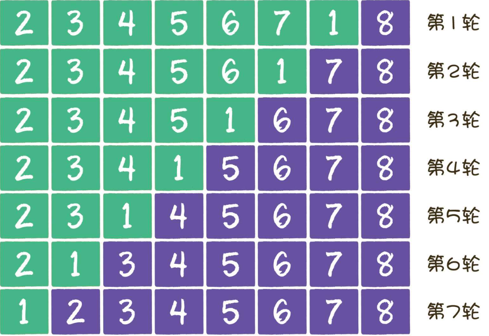
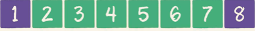

### 冒泡排序


#### 1.基本思想

一个待排序的序列，从序列头部开始，相邻位置两两比较，根绝大小交换位置，直到把最值元素交换到序列末位，循环此次过程，直至序列称为有序序列。

#### 2.操作步骤

```
//待排序序列
[5, 8, 6, 3, 9, 2, 1, 7]
//每次排序的结果
[5, 6, 3, 8, 2, 1, 7, 9] 第一次排序......
[5, 3, 6, 2, 1, 7, 8, 9] 第二次排序......
[3, 5, 2, 1, 6, 7, 8, 9]
[3, 2, 1, 5, 6, 7, 8, 9]
[2, 1, 3, 5, 6, 7, 8, 9]
[1, 2, 3, 5, 6, 7, 8, 9]
```

#### 3.代码实现

```java
private static void bubbleSort(int arr[]) {
    for (int i = 0; i < arr.length - 1; i++) {
        for (int j = 0; j < arr.length - i - 1; j++) {
            int temp;
            if (arr[j] > arr[j + 1]) {
                temp = arr[j];
                arr[j] = arr[j + 1];
                arr[j + 1] = temp;
            }
        }
            /*
            [5, 6, 3, 8, 2, 1, 7, 9]
            [5, 3, 6, 2, 1, 7, 8, 9]
            [3, 5, 2, 1, 6, 7, 8, 9]
            [3, 2, 1, 5, 6, 7, 8, 9]
            [2, 1, 3, 5, 6, 7, 8, 9]
            [1, 2, 3, 5, 6, 7, 8, 9]
            [1, 2, 3, 5, 6, 7, 8, 9]//最后一轮是不必要的，因为已经有序了
            */
    }
}
```

#### 4.优化

* 如果排序到最后若干轮，列表已经有序，如何优化？

```java
private static void bubbleSort(int arr[]) {
    for (int i = 0; i < arr.length - 1; i++) {
        boolean sorted = true;
        for (int j = 0; j < arr.length - i - 1; j++) {
            int temp;
            if (arr[j] > arr[j + 1]) {
                temp = arr[j];
                arr[j] = arr[j + 1];
                arr[j + 1] = temp;
                sorted = false;//如果本轮循环有元素交换，说明无序，否则就是有序了，跳出大循环
            }
        }
        if (sorted) {//避免不必要排序
            break;
        }
        /*
        [5, 6, 3, 8, 2, 1, 7, 9]
        [5, 3, 6, 2, 1, 7, 8, 9]
        [3, 5, 2, 1, 6, 7, 8, 9]
        [3, 2, 1, 5, 6, 7, 8, 9]
        [2, 1, 3, 5, 6, 7, 8, 9]
        [1, 2, 3, 5, 6, 7, 8, 9]//减少一轮循环
        * */
    }
}
```

* 如果数组的后半段是有序的，怎么避免每次循环都进行无用的比较

```java
private static void bubbleSort(int arr[]) {
    int lastExchangeIndex = 0;
    int sortBorder = arr.length - 1;
    for (int i = 0; i < arr.length - 1; i++) {
        boolean sorted = true;
        for (int j = 0; j < sortBorder; j++) {
            int temp;
            if (arr[j] > arr[j + 1]) {
                temp = arr[j];
                arr[j] = arr[j + 1];
                arr[j + 1] = temp;
                sorted = false;//如果本轮循环有元素交换，说明无序，否则就是有序了，跳出大循环
                lastExchangeIndex = j;
            }
        }
        sortBorder = lastExchangeIndex;
        if (sorted) {//避免不必要排序
            break;
        }
        /* 仅比较10次就能得出结果，如果用前两次的方法，要比较28次
        [3, 2, 1, 4, 5, 6, 7, 8]
        [2, 1, 3, 4, 5, 6, 7, 8]
        [1, 2, 3, 4, 5, 6, 7, 8]
        * */
    }
}
```

#### 5.变种-鸡尾酒排序

一个数组【2，3，4，5，6，7，8，1】，如何进行排序？冒泡排序？




就交换一个元素，用了七轮比较，会不会有点憋屈?

鸡尾酒的做法就是把冒泡排序的过程从单向变成双向:

第一轮和冒泡排序一样，从左往右


第二轮开始不一样，此时从右往左



第三轮，需要重新从左往右进行比较排序，没有可交换的元素才能证明已经有序。

> 鸡尾酒排序的时间复杂度是O(n²)，如果在大部分元素处于有序状态的话会接近O(n)

代码实现：

```java
    private static void sort(int[] arr) {
        int temp;
        for (int i = 0; i < arr.length / 2; i++) {
            boolean sorted = true;
            //从左往右排序
            for (int j = i; j < arr.length - i - 1; j++) {
                if (arr[j] > arr[j + 1]) {
                    temp = arr[j];
                    arr[j] = arr[j + 1];
                    arr[j + 1] = temp;
                    sorted = false;
                }
            }
            System.out.println(Arrays.toString(arr));
            if (sorted) break;
            //从右往左排序之前，重置sorted
            sorted = true;
            //从右往左
            for (int j = arr.length - i - 1; j > i; j--) {
                if (arr[j] < arr[j - 1]) {
                    temp = arr[j];
                    arr[j] = arr[j - 1];
                    arr[j - 1] = temp;
                    sorted = false;
                }
            }
            System.out.println(Arrays.toString(arr));
            if (sorted) break;
        }
        //按照鸡尾酒排序思路，只需三次便可得到结果，最后一次排序为算法需要
/*
[2, 3, 4, 5, 6, 7, 1, 8]
[1, 2, 3, 4, 5, 6, 7, 8]
[1, 2, 3, 4, 5, 6, 7, 8]
*/
    }
}
```

[参考写法]([https://zh.wikipedia.org/wiki/%E9%B8%A1%E5%B0%BE%E9%85%92%E6%8E%92%E5%BA%8F](https://zh.wikipedia.org/wiki/鸡尾酒排序))

```java
    private static void sort2(int [] arrs){
        int left = 0;
        int right = arrs.length -1;
        int temp;
        boolean sorted = true;
        while (left < right){
            for (int i = left; i < right; i++) {
                if (arrs[i] > arrs[i + 1]){
                    temp = arrs[i + 1];
                    arrs[i + 1] =arrs[i];
                    arrs[i] = temp;
                    sorted = false;
                }
            }
            if (sorted ){
                break;
            }
            sorted = true;
            System.out.println(">>>"+Arrays.toString(arrs));
            right --;//最大值到最右
            for (int i = right; i > left; i--) {
                if (arrs[i - 1] > arrs[i]){
                    temp = arrs[i - 1];
                    arrs[i - 1] = arrs[i ];
                    arrs[i ] = temp;
                    sorted = false;
                }
            }
            System.out.println("<<<"+Arrays.toString(arrs));
            left ++ ;
            if (sorted ){
                break;
            }
            sorted = true;
        }
    }
```