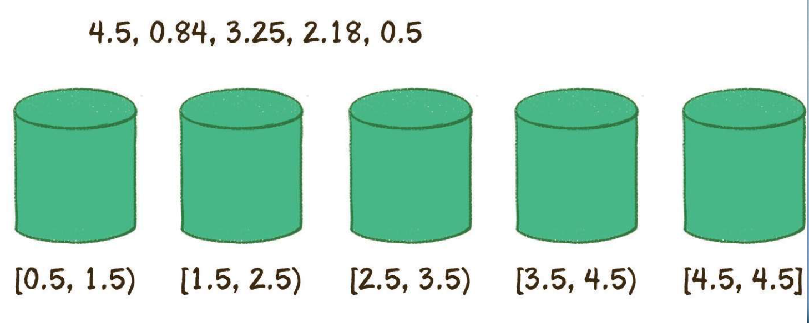

## 桶排序

线性时间的排序算法，所谓的“桶”代表一个区间范围，可以存放若干元素。


### 原理



第一步建立桶，确定每个桶的区间范围，建立多少个桶和区间范围方式不同。

举例：

建立桶的数量和元素数量相同

区间跨度 = （最大值-最小值）/ （桶的数量 - 1）

第二步，遍历元素放入相对应的桶中，

第三步，对桶内元素进行排序

第四步，遍历输出。


### 代码

```java
private static double[] bucketSort(double [] arr){
    double max = arr[0];
    double min = arr[0];


    for (int i = 0; i < arr.length; i++) {
        if (arr[i] > max){
            max = arr[i];
        }
        if (arr[i] < min){
            min = arr[i];
        }
    }

    //初始化桶
    int bucketNum = arr.length;
    ArrayList<LinkedList<Double>> bucketList = new ArrayList<>(bucketNum);
    //每个桶的区间长度，步长
    double d = max - min;
    double step = d/(bucketNum - 1);
    for (int i = 0; i < bucketNum; i++) {
        bucketList.add(new LinkedList<>());
    }
    //遍历原始数组 将元素放入桶中
    //区间跨度=（最大值-最小值）/(桶的数量-1)
    for (int i = 0; i < arr.length; i++) {
        int num = (int) ((arr[i] - min) / step);
        bucketList.get(num).add(arr[i]);
    }

    for (int i = 0; i < bucketList.size(); i++) {
        Collections.sort(bucketList.get(i));
    }
    double [] sortedArray = new double[arr.length];
    int index = 0;
    for (LinkedList<Double> list : bucketList) {
        for (Double aDouble : list) {
            sortedArray[index] = aDouble;
            index ++;
        }
    }
    return sortedArray;
}
```


### 时间复杂度

第1步，求数列最大、最小值，运算量为n。

第2步，创建空桶，运算量为n。

第3步，把原始数列的元素分配到各个桶中，运算量为n。

第4步，在每个桶内部做排序，在元素分布相对均匀的情况下，所有桶的运算量之和为n。

第5步，输出排序数列，运算量为n。

因此，桶排序的总体时间复杂度为O(n)。

### 空间复杂度

O(n)

### 最坏情况

第一个桶中有n-1个元素，最后一个桶中有1个元素，时间复杂度退化O(nlogn),而且浪费很多空桶。